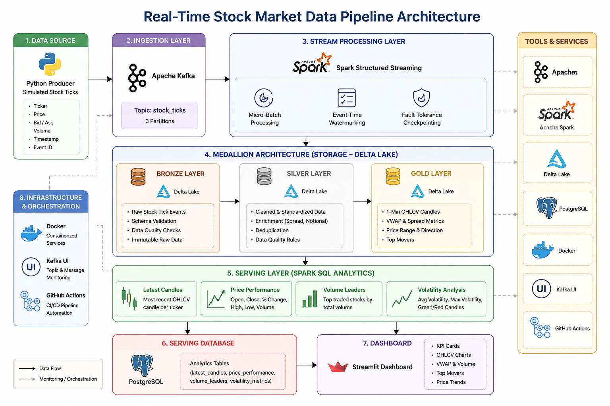
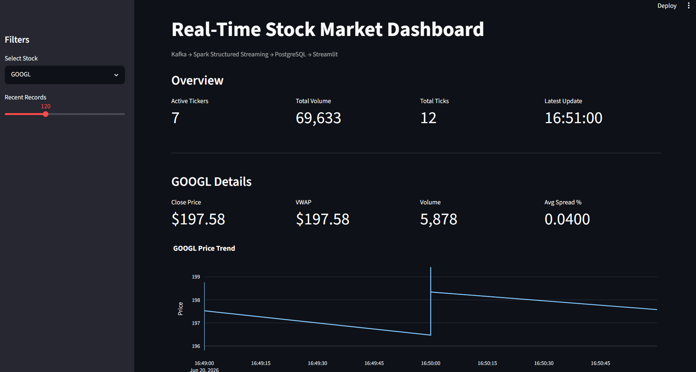
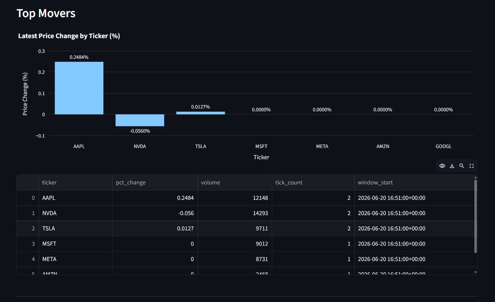
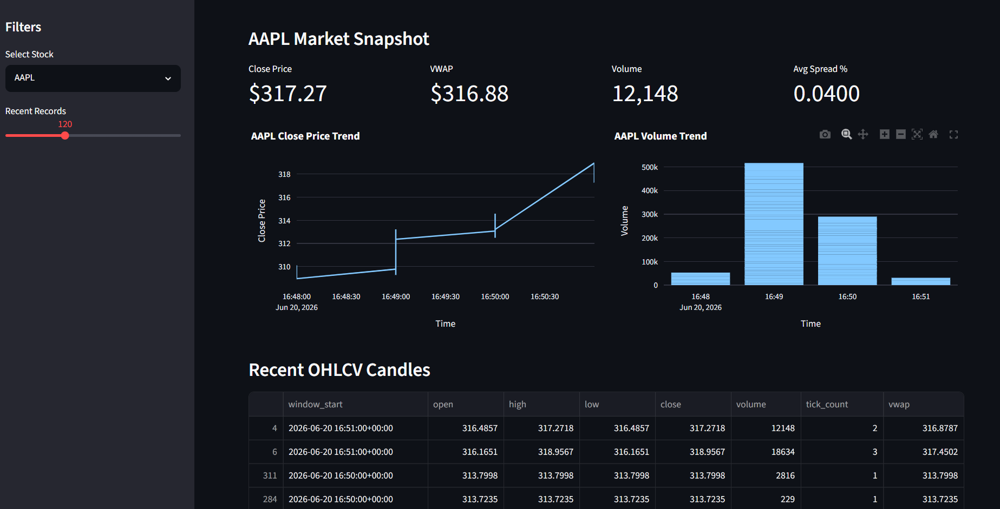

# Real-Time Stock Market Data Pipeline

## Overview

Financial markets generate millions of events every day that must be processed with low latency and high reliability. Traditional batch pipelines cannot provide the speed required for real-time monitoring and analytics.

This project builds an end-to-end real-time stock market analytics platform using Apache Kafka, Spark Structured Streaming, Delta Lake, PostgreSQL, Docker, and Streamlit.

The platform ingests simulated stock market events, processes them through a Medallion Architecture (Bronze → Silver → Gold), generates analytical datasets, and serves insights through an interactive dashboard.

---

## Business Problem

Modern financial applications require the ability to:

- Process stock market events in real time
- Handle continuous streams of trading data
- Maintain data quality and reliability
- Calculate financial metrics continuously
- Deliver low-latency analytics to business users
- Support scalable downstream applications

This project demonstrates how modern streaming technologies can be used to build a production-style stock market analytics platform.

---

## Architecture

The platform follows a real-time Medallion Architecture built on Apache Kafka, Spark Structured Streaming, Delta Lake, PostgreSQL, and Streamlit.

The pipeline ingests stock tick events, processes them through Bronze, Silver, and Gold layers, generates analytical datasets through a dedicated Spark SQL serving layer, and exposes insights through an interactive Streamlit dashboard.



### Architecture Components

#### Data Source
- Python Producer
- Simulated stock market tick generation
- Event ID, ticker, price, bid price, ask price, volume, timestamp

#### Ingestion Layer
- Apache Kafka
- `stock_ticks` topic
- Real-time event streaming
- Multi-partition architecture

#### Stream Processing Layer
- Spark Structured Streaming
- Micro-batch processing
- Event-time watermarking
- Fault-tolerant checkpointing

#### Bronze Layer (Delta Lake)
- Raw stock tick events
- Schema validation
- Data quality checks
- Immutable event storage

#### Silver Layer (Delta Lake)
- Data cleansing
- Standardization
- Deduplication
- Spread calculations
- Notional value calculations

#### Gold Layer (Delta Lake)
- OHLCV (Open, High, Low, Close, Volume) Candles
- VWAP (Volume Weighted Average Price)
- Price movement metrics
- Trading activity metrics
- Top movers analytics

#### Serving Layer (Spark SQL)
- Latest Candles
- Price Performance
- Volume Leaders
- Volatility Analysis

#### Serving Database
- PostgreSQL
- Dashboard-ready analytics tables

#### Dashboard Layer
- Streamlit
- KPI monitoring
- Top movers analytics
- Price trends
- Volume trends
- OHLCV analytics

#### Infrastructure & DevOps
- Docker
- Kafka UI
- GitHub Actions CI/CD

---

## Technology Stack

| Layer | Technology |
|---------|------------|
| Programming | Python |
| Streaming Platform | Apache Kafka |
| Stream Processing | Apache Spark Structured Streaming |
| Processing Framework | PySpark |
| Storage Format | Delta Lake |
| Serving Layer | Spark SQL |
| Database | PostgreSQL |
| Dashboard | Streamlit |
| Containerization | Docker |
| Monitoring | Kafka UI |
| CI/CD | GitHub Actions |
| Version Control | Git & GitHub |

---

## Data Pipeline

### Bronze Layer

The Bronze layer ingests raw stock tick events from Kafka and stores them in Delta Lake.

Responsibilities:

- Schema validation
- Raw event persistence
- Fault tolerance through checkpointing
- Data quality validation

Example fields:

```text
event_id
ticker
price
bid
ask
volume
event_time
```

---

### Silver Layer

The Silver layer enriches and standardizes market events.

Calculated metrics:

- Spread
- Spread Percentage
- Notional Value
- Price Bucket Classification

This layer prepares data for analytical consumption.

---

### Gold Layer

The Gold layer generates business-ready analytical datasets.

Metrics include:

- OHLCV (Open, High, Low, Close, Volume) Candles
- VWAP (Volume Weighted Average Price)
- Average Spread Percentage
- Price Range
- Price Direction
- Top Movers Analysis

These datasets are loaded into PostgreSQL for serving and visualization.

---

## Serving Layer

A dedicated Spark SQL analytics layer was implemented on top of the Gold layer.

### Latest Candles

Returns the most recent OHLCV candle for each stock ticker.

### Price Performance

Calculates:

- Day Open
- Day Close
- Percentage Change
- Daily High
- Daily Low
- Total Volume

### Volume Leaders

Identifies the most actively traded stocks based on cumulative trading volume.

### Volatility Analysis

Calculates:

- Average Volatility
- Maximum Volatility
- Green Candle Count
- Red Candle Count

The serving layer provides dashboard-ready analytical datasets for downstream applications.

---

## Dashboard

A Streamlit dashboard was developed on top of PostgreSQL to provide real-time market monitoring and analytics.

### Dashboard Features

- Stock selection by ticker
- Market-wide KPI monitoring
- Top movers analysis
- Price trend visualization
- Volume trend monitoring
- VWAP (Volume Weighted Average Price) tracking
- OHLCV (Open, High, Low, Close, Volume) reporting
- Interactive filtering

---

## Screenshots

### Architecture

Real-time Medallion Architecture using Kafka, Spark Structured Streaming, Delta Lake, PostgreSQL, and Streamlit.


---

### Infrastructure

Dockerized environment running Kafka, PostgreSQL, Kafka UI, and supporting services.


---

### Kafka Producer

Simulated stock market events continuously generated and published into Kafka.


---

### Kafka Topics

Kafka topic configuration and metadata.


---

### Live Market Events

Real-time stock market events flowing through Kafka.


---

### Pipeline Execution

Spark Structured Streaming processing events through Bronze, Silver, and Gold layers.


---

### Gold Layer Analytics

Aggregated OHLCV (Open, High, Low, Close, Volume) and market analytics stored in PostgreSQL.


---

### Dashboard Overview

Market-wide monitoring dashboard displaying:

- Active Tickers
- Trading Volume
- Total Tick Events
- Latest Market Update



---

### Top Movers Analytics

Real-time visualization of the largest stock price movements across tracked securities.



---

### Stock Analysis Dashboard

Detailed stock-level analytics including:

- Close Price
- VWAP (Volume Weighted Average Price)
- Volume
- Average Spread Percentage
- Price Trend
- Volume Trend
- Recent OHLCV Candles



---

## Key Features

### Real-Time Processing

- Kafka-based event streaming
- Spark Structured Streaming
- Continuous micro-batch processing

### Delta Lake

- Bronze, Silver, and Gold storage layers
- ACID transactions
- Reliable data persistence

### Fault Tolerance

- Streaming checkpoints
- Recovery support
- Exactly-once processing semantics

### Data Quality

- Schema validation
- Event standardization
- Deduplication

### DevOps

- Dockerized infrastructure
- GitHub Actions CI/CD workflow
- Automated repository validation

---

## Project Structure

```text
real-time-stock-market-pipeline/
│
├── producer/
│   └── producer.py
│
├── consumer/
│   └── bronze_stream.py
│
├── transformation/
│   ├── silver.py
│   └── gold.py
│
├── serving/
│   └── analytics.py
│
├── dashboard/
│   └── app.py
│
├── docker/
│   ├── docker-compose.yml
│   └── init.sql
│
├── config/
│   └── config.py
│
├── Screenshots/
│
├── .github/
│   └── workflows/
│
├── requirements.txt
│
└── README.md
```

---

## Project Outcomes

- Built an end-to-end real-time stock market analytics platform.
- Implemented Medallion Architecture using Delta Lake.
- Processed streaming stock events using Kafka and Spark Structured Streaming.
- Generated OHLCV (Open, High, Low, Close, Volume) market candles.
- Calculated VWAP (Volume Weighted Average Price) and trading metrics.
- Developed a real-time Streamlit dashboard.
- Implemented a dedicated Spark SQL serving layer.
- Loaded analytical datasets into PostgreSQL.
- Added GitHub Actions CI/CD validation workflow.
- Containerized the entire platform using Docker.

---

## Skills Demonstrated

- Python
- Apache Kafka
- Apache Spark
- PySpark
- Spark Structured Streaming
- Delta Lake
- PostgreSQL
- Docker
- Streamlit
- GitHub Actions
- Real-Time Data Processing
- Data Engineering
- Data Modeling
- Financial Analytics

---

## Author

Dharmik Patel

Portfolio: https://www.ptldharmik.com

GitHub: https://github.com/dharu0908
