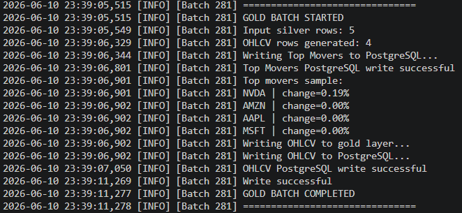
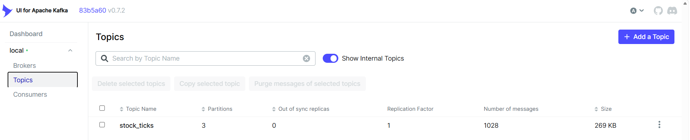
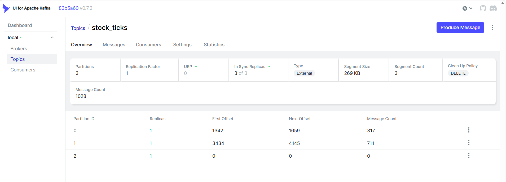
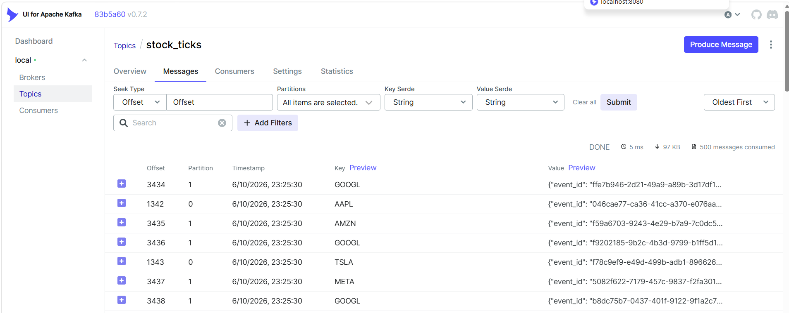
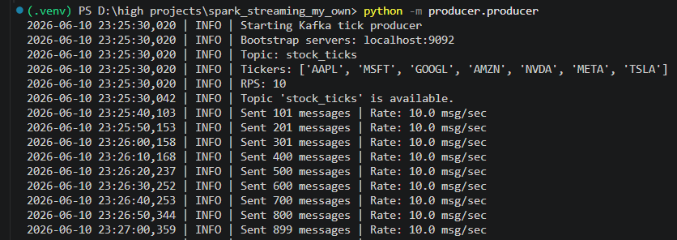
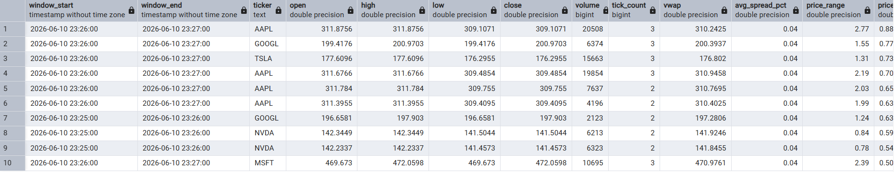
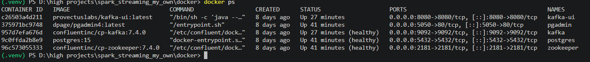

# 📈 Real-Time Stock Market Data Pipeline

**Production-grade real-time streaming pipeline** using **Apache Kafka + Spark Structured Streaming** with **Medallion Architecture** (Bronze → Silver → Gold).


---

## ✨ Key Highlights

- **End-to-End Real-time Pipeline** ingesting, processing, and analyzing live-like stock tick data
- **Medallion Architecture**: Bronze (raw + validated), Silver (cleansed + enriched), Gold (aggregated analytics)
- **Robust Data Quality**: Schema validation, Dead Letter Queue (DLQ), deduplication, watermarking
- **Advanced Financial Metrics**: 1-minute OHLCV candles, VWAP, spread analysis, price range, Top Movers
- **Fault Tolerant & Scalable**: Checkpointing, partitioning, configurable micro-batches
- **Fully Containerized** with Docker Compose + Kafka UI + PostgreSQL

---

## 🏗️ Architecture

```mermaid
graph TD
    A[Producer<br/>Python + Confluent Kafka] 
    --> B[(Kafka Topic: stock_ticks<br/>3 Partitions)]
    B --> C[Bronze Layer<br/>Spark Streaming + Parsing + DLQ]
    C --> D[Silver Layer<br/>Cleaning + Enrichment + Deduplication]
    D --> E[Gold Layer<br/>Windowed OHLCV + Business Metrics]
    E --> F[(PostgreSQL<br/>gold_ohlcv_1min + gold_top_movers)]
    E --> G[Parquet<br/>(GOLD_PATH)]
```

---

## 🛠️ Tech Stack

| Component          | Technology                                      |
|--------------------|-------------------------------------------------|
| **Ingestion**      | Python, Confluent Kafka Producer                |
| **Streaming**      | Apache Kafka, Spark Structured Streaming 3.5    |
| **Processing**     | PySpark, Watermarking, Window Aggregations      |
| **Storage**        | Parquet (Bronze/Silver/Gold), PostgreSQL        |
| **Orchestration**  | Docker Compose                                  |
| **Monitoring**     | Kafka UI                                        |

---

## 📁 Project Structure

```bash
real-time-stock-market-pipeline/
├── config/config.py
├── producer/producer.py
├── consumer/bronze_stream.py          # Bronze consumer
├── transformation/
│   ├── silver.py
│   └── gold.py
├── docker/
│   ├── docker-compose.yml
│   └── init.sql
├── data/                              # Bronze, Silver, Gold, Checkpoints
├── screenshots/
└── README.md
```

---

## 🚀 Quick Start

### Prerequisites
- Docker & Docker Compose
- Python 3.9+ (`confluent-kafka`, `pyspark`)

### 1. Start Infrastructure
```bash
cd docker
docker-compose up -d
```

### 2. Run Pipeline

**Terminal 1 - Producer:**
```bash
python producer/producer.py --rps 10
```

**Terminal 2 - Bronze Layer:**
```bash
python consumer/bronze_stream.py
```

**Terminal 3 - Silver Layer:**
```bash
python transformation/silver.py
```

**Terminal 4 - Gold Layer:**
```bash
python transformation/gold.py
```

### Access Points
- **Kafka UI**: http://localhost:8080
- **PostgreSQL**: `localhost:5432` (user: `stockuser`, pass: `stockpass`)
- **pgAdmin**: http://localhost:5050

---

## 📸 Screenshots

### Pipeline Execution


### Kafka Setup




### Producer


### Gold Layer Analytics


### Infrastructure


---

## 🔮 Future Enhancements

- Airflow / Dagster orchestration
- Cloud deployment (AWS MSK + EMR + Redshift)
- Real-time dashboard (Grafana / Superset)
- Machine Learning models for price prediction

---

**Made with ❤️ by Dharmik Patel**

**⭐ Star this repo if you found it useful!**
